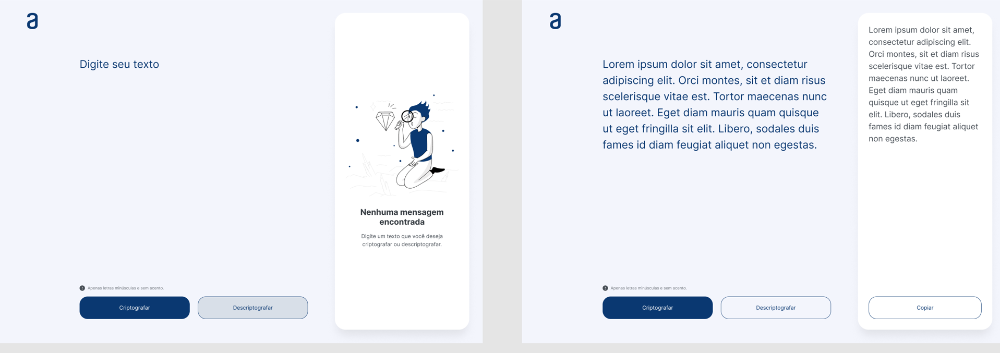

# Challenger ONE - T4

## Construa um decodificador de texto com Javascript

 

**Desenvolvido por Emanuel Brito**
 

Neste repositório se encontra a resolução do Challenge ONE, que nada mais é que um decodificador onde se inserem uma palavra e a saída e a decodificação da palavra, essa codificação segue alguns parâmetros estipulados no próprio desafio.

Esse desafio tem como objetivo testar nossa habilidade com JavaScript, e nossa utilização do HTML E CSS aprendidos nas aulas de Iniciante em Programação.
 

 

### Criptografia

- As "chaves" de criptografia que foram utiliazdas:

  | Letra | Converter                 |
  | ----- | ------------------------- |
  | `e`   | Convertida para (_enter_) |
  | `i`   | Convertida para (_imes_)  |
  | `a`   | Convertida para (_ai_)    |
  | `o`   | Convertida para (_ober_)  |
  | `u`   | Convertida para (_ufat_)  |

### Etapas

1. Elementos principais da página
2. Fazer a criptografia
3. Fazer a descriptografia
4. Extra! Botão copiar

### Extra

- Responsividade (_media queries_)
- Botão DARKMODE
- Footer (Informação e redes sociais)
